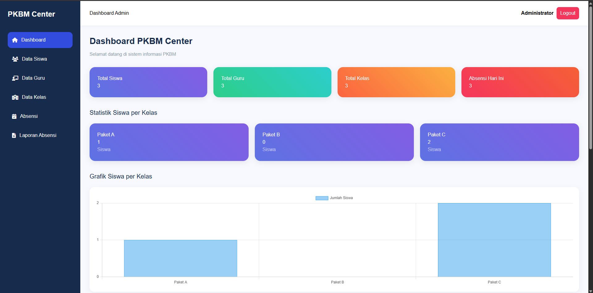
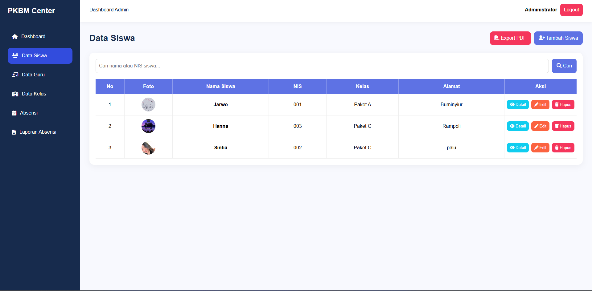
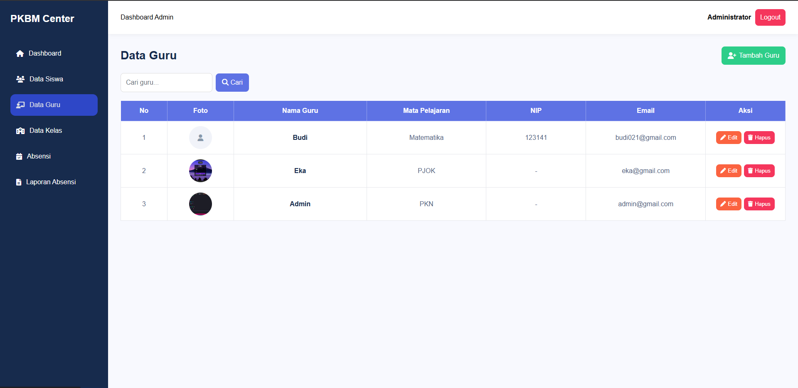
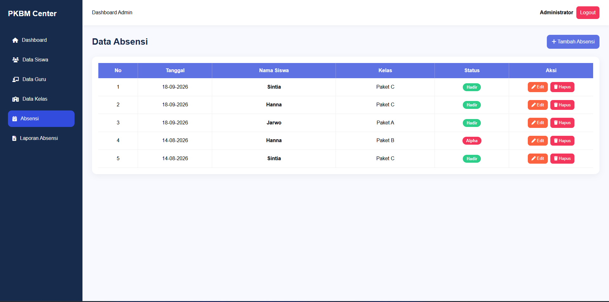
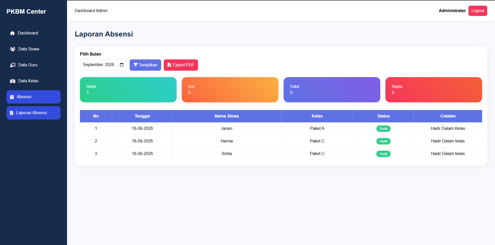

# PKBM Center

**PKBM Center** adalah aplikasi web sederhana untuk membantu pengelolaan data pada Pusat Kegiatan Belajar Masyarakat (PKBM).

Project ini dibuat sebagai portfolio untuk menerapkan pengembangan aplikasi web menggunakan Laravel, PHP, dan MySQL.

## 🌐 Live Demo

**https://pkbm-center.gt.tc**

> Demo website dapat digunakan untuk melihat fitur aplikasi secara langsung.

## 📌 Fitur

* 🔐 Login dan autentikasi pengguna
* 👨‍🎓 CRUD Data Siswa
* 👨‍🏫 CRUD Data Guru
* 🏫 CRUD Data Kelas
* 🔗 Relasi Siswa dan Kelas
* 📋 Absensi Siswa
* 📊 Laporan Absensi berdasarkan bulan
* 📈 Dashboard dengan ringkasan data dan grafik
* 🖼️ Upload foto siswa
* 👤 Role Admin
* 📄 Export data siswa ke PDF

## 🛠️ Teknologi

* **PHP**
* **Laravel**
* **MySQL**
* **Blade**
* **HTML & CSS**
* **JavaScript**
* **Laravel Breeze**

## 📸 Screenshots

### Dashboard



### Data Siswa



### Data Guru



### Data Kelas


### Absensi



### Laporan Absensi



## 📂 Struktur Project

Project ini menggunakan struktur standar Laravel, dengan beberapa bagian utama:

```text
app/
├── Http/
├── Models/
└── ...

database/
├── migrations/
└── seeders/

resources/
└── views/

routes/
└── web.php

public/
└── ...

README.md
```

## ⚙️ Instalasi Lokal

Clone repository:

```bash
git clone https://github.com/hanameteor-web/pkbm-center.git
```

Masuk ke folder project:

```bash
cd pkbm-center
```

Install dependency:

```bash
composer install
```

Salin file environment:

```bash
cp .env.example .env
```

Generate application key:

```bash
php artisan key:generate
```

Sesuaikan konfigurasi database pada file `.env`, kemudian jalankan:

```bash
php artisan migrate
```

Buat symbolic link untuk storage:

```bash
php artisan storage:link
```

Jalankan aplikasi:

```bash
php artisan serve
```

Aplikasi dapat diakses melalui:

```text
http://127.0.0.1:8000
```

## 👩‍💻 About This Project

Project ini dikembangkan sebagai project portfolio untuk mempraktikkan:

* Laravel MVC
* CRUD
* Database dan migration
* Eloquent ORM dan relationship
* Authentication dan authorization
* File upload
* Absensi dan laporan
* Export PDF
* Deployment aplikasi Laravel ke hosting

## 🔗 Links

* **Live Demo:** https://pkbm-center.gt.tc
* **GitHub Repository:** https://github.com/hanameteor-web/pkbm-center

## 📄 License

Project ini dibuat untuk keperluan pembelajaran dan portfolio.
